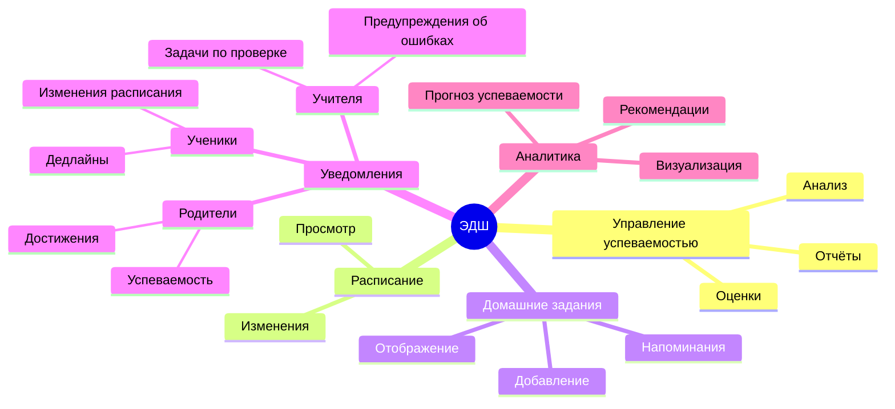
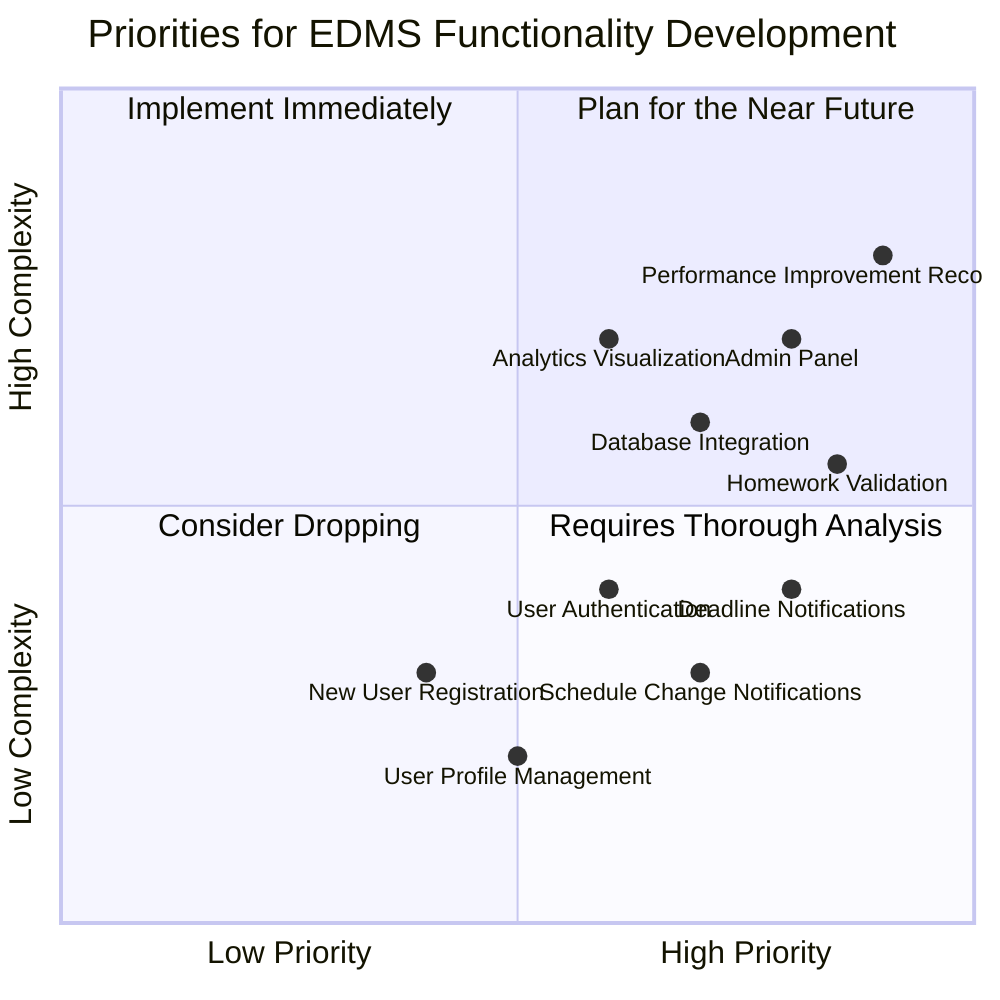
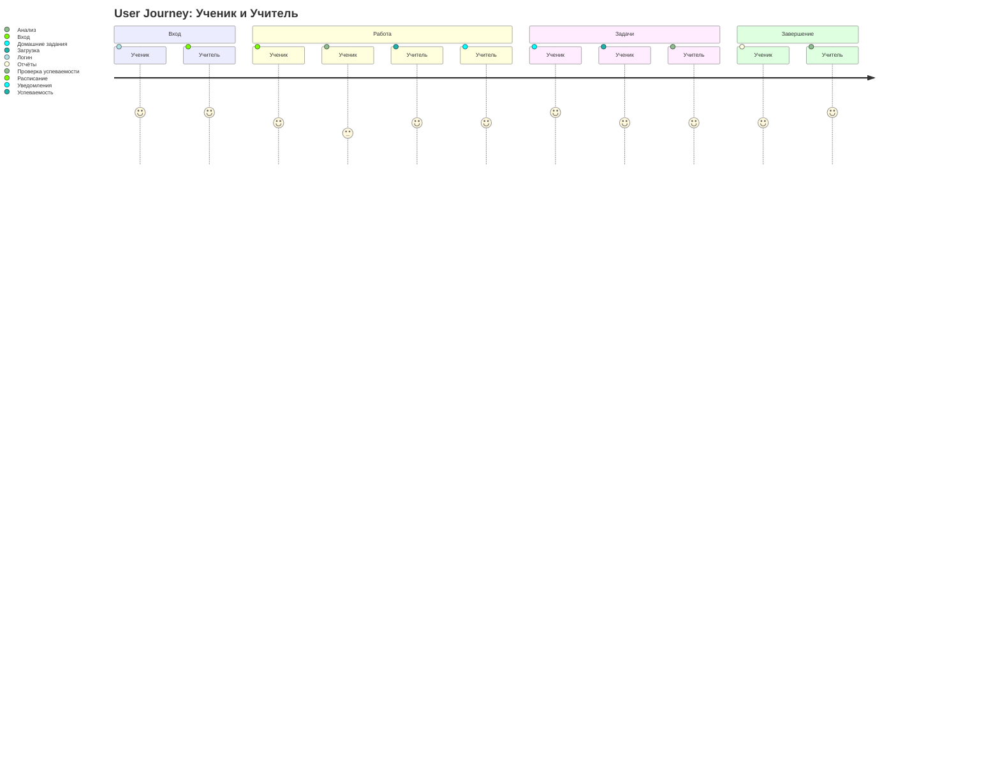
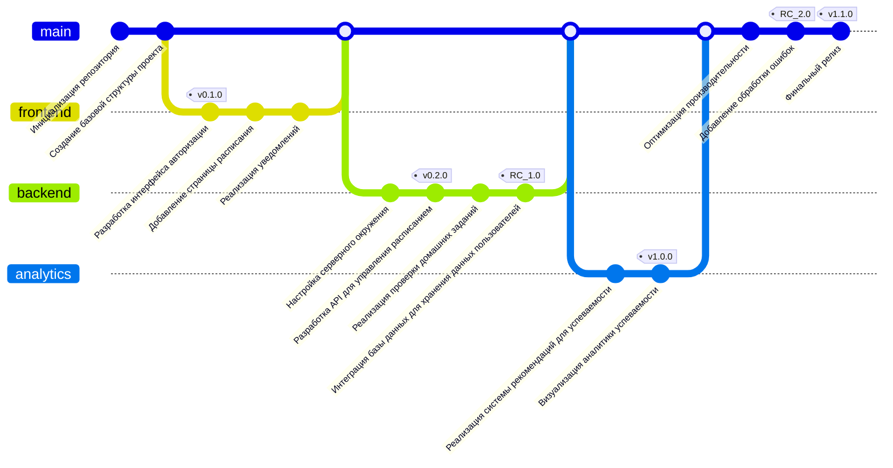

# Проект: Электронный дневник и журнал (ЭДШ)

Добро пожаловать в репозиторий системы **Электронный дневник и журнал (ЭДШ)**, предназначенной для управления успеваемостью, расписанием и аналитикой в образовательных учреждениях.

Проект предоставляет функционал для учеников, учителей и родителей. В процессе разработки были использованы различные диаграммы для отображения архитектуры системы и этапов работы.

## Оглавление
1. [Описание диаграмм](#описание-диаграмм)
   - [Mindmap (Карты мыслей)](#mindmap-карты-мыслей)
   - [Quadrant Chart: Приоритеты разработки](#quadrant-chart-приоритеты-разработки)
   - [Journey Diagram: Путь пользователя](#journey-diagram-путь-пользователя)
   - [GitGraph: История коммитов](#gitgraph-история-коммитов)
2. [Процесс разработки](#процесс-разработки)

---

## Описание диаграмм

### 1. **Mindmap (Карты мыслей): Функциональные возможности**

### 2. **Quadrant Chart: Приоритеты разработки**
- Quadrant 1: Элементы, которые необходимо реализовать в ближайшем будущем.
- Quadrant 2: Элементы, которые следует реализовать немедленно.
- Quadrant 3: Элементы с низким приоритетом.
- Quadrant 4: Элементы, требующие более детального анализа

### 3. **Journey Diagram: Путь пользователя**

### 4. **GitGraph: История коммитов**
Ветка **GitGraph** отображает историю изменений в проекте, включая ключевые коммиты и слияния веток. С помощью этой диаграммы можно отслеживать развитие проекта, увидеть, как различные функции (например, интерфейс, серверная логика и аналитика) были реализованы параллельно, и как они были объединены в основную ветку.

## Ветки и их описание

### **frontend**
Разработка интерфейса для пользователей, включая авторизацию, расписание и уведомления.  
Ключевые коммиты:
- **Разработка интерфейса авторизации (v0.1.0)**: Создание страницы авторизации для пользователей.
- **Добавление страницы расписания**: Добавление страницы для отображения расписания.
- **Реализация уведомлений**: Разработка системы уведомлений для пользователей.

### **backend**
Реализация серверной логики, API и интеграция с базой данных.  
Ключевые коммиты:
- **Настройка серверного окружения**: Настройка сервера для обработки запросов.
- **Разработка API для управления расписанием (v0.2.0)**: Создание API для взаимодействия с расписанием.
- **Интеграция базы данных для хранения данных пользователей (RC_1.0)**: Подключение базы данных для хранения информации.

### **analytics**
Реализация аналитики и системы рекомендаций для улучшения успеваемости учеников.  
Ключевые коммиты:
- **Реализация системы рекомендаций для успеваемости**: Разработка алгоритмов для улучшения успеваемости.
- **Визуализация аналитики успеваемости (v1.0.0)**: Визуализация данных о успеваемости учеников.

### **main**
Основная ветка, объединяющая изменения из всех этапов разработки.  
Ключевые коммиты:
- **Оптимизация производительности**: Повышение эффективности работы системы.
- **Добавление обработки ошибок (RC_2.0)**: Добавление механизмов обработки ошибок для улучшенной стабильности.
- **Финальный релиз (v1.1.0)**: Завершающий этап с полным функционалом, готовым к использованию в продакшн-среде.

## Заключение

Диаграмма GitGraph помогает отслеживать историю разработки и показывает, как различные части проекта развивались в параллельных ветках. Коммиты в этих ветках соответствуют ключевым этапам в реализации функционала, таких как интерфейс, серверная логика и аналитика. Все эти изменения в конечном итоге были объединены в основную ветку для финальной версии проекта.
